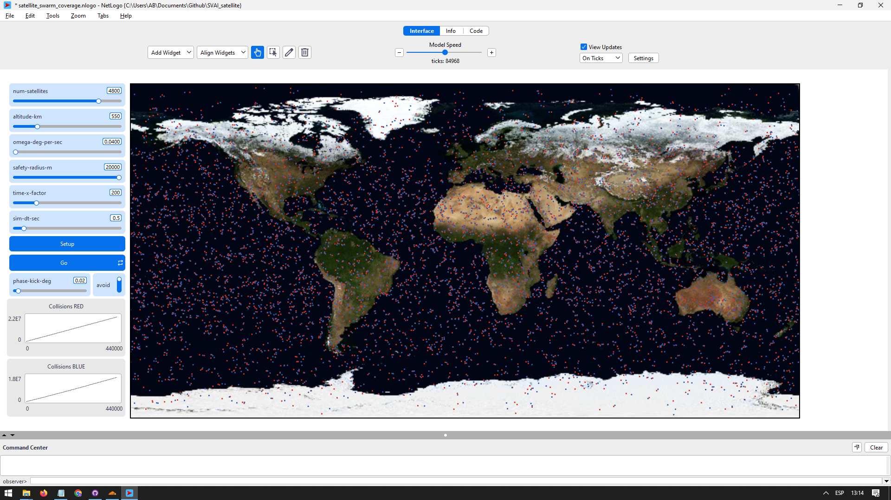

## Coordinación Descentralizada de Satélites: Un Enfoque Basado en Agentes
### MULCIA - Síntesis, Verificación y Razonamiento sobre Agentes Inteligentes

**Autor: Alejandro Barranco Ledesma**

---

Simulación multiagente en NetLogo de una constelación LEO donde cada satélite, usando solo información local, aplica reglas simples de evitación por proximidad (phase-kick) para estudiar si emerge una coordinación global estable que reduzca conflictos frente a un baseline sin control.

---

### Instrucciones de uso

Este proyecto se ejecuta mediante **Netlogo**. Para comenzar:

1. Abre el archivo svai_satellite.nlogo.nlogox
2. Lee la memoria (MEMORIA.pdf) para detalles de implementación
